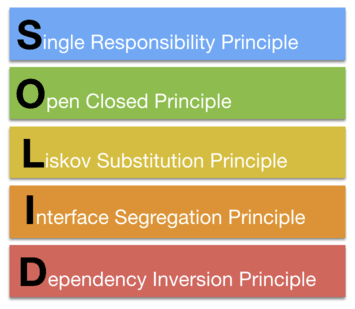

# Princípios do SOLID

SOLID é um acrônimo para os princípios listados abaixo:



## Single Responsability Principle

- Uma classe deve ter exclusivamente uma responsabilidade;
- Alterar um código nessa classe não deve influenciar o funcionamento de outros códigos;
- Classes com uma única responsabilidade são mais legíveis e testáveis;

### Exemplo

Um exemplo seria pensar em uma classe que define um usuário. Essa classe não deveria possuir nenhum código relacionado à validação do e-mail, já que essa validação não está associada diretamente com o comportamento de um usuário.

```tsx
class User {
	public name: string;
	public email: string;

	constructor(name: string, email: string) {
		this.name = name;

		if (this.validateEmail(email)) {
		  this.email = email;
		} else {
			throw new Error("Invalid email.")
		}
  }

	validateEmail(email: string) {
		// Validation login
	}
}
```

O correto seria dividirmos o comportamento do e-mail do usuário em outra classe:

```tsx
class Email {
	public email: string;

	constructor(email: string) {
		if (this.validateEmail(email)) {
		  this.email = email;
		} else {
			throw new Error("Invalid email.")
		}
	}

	validateEmail(email: string) {
		// Validation login
	}
}

class User {
	public name: string;
	public email: Email;

	constructor(name: string, email: Email) {
		this.name = name;
		this.email = email;
  }
}
```

## Open Closed Principle

- As entidades da aplicação devem ser **abertas para extensão**;
- As entidades da aplicação devem ser **fechadas para modificações**;

```tsx
import { resolve } from 'path';

class FileUpload {
  private file: File;

  constructor(file: File) {
    this.file = file;
  }

  getDestination(): string {
    return resolve(__dirname, '..', 'uploads', 'files');
  }

  upload() {
    // Upload logic
  }
}

class ImageUpload extends FileUpload {
  getDestination(): string {
    return resolve(__dirname, '..', 'uploads', 'images');
  }
}
```

## Liskov Substitution Principle

Continuando no princípio anterior, independente do driver de upload que passamos para a função `uploadFile`, a aplicação continua funcionamento corretamente.

Esse princípio defende o uso de polimorfismo, assim como usamos no princípio anterior, para estabelecer que um objeto pode ser substituído por qualquer outro do mesmo tipo sem danificar o comportamento da aplicação.

Já que estamos utilizando TypeScript com suporte às interfaces, o mesmo já vai nos avisar de qualquer erro ferindo esse princípio.

```tsx
interface UploadDriver {
	upload(file: File): void;
}

class S3Upload implements UploadDriver {
	public accessKey: string;
	public secretKey: string;

  public upload(file: File) {
    // AWS S3 Upload logic
	}
}

class LocalUpload implements UploadDriver {
	public destinationFolder: string;

  public upload(file: File) {
		// Local upload logic
	}
}

function uploadFile(file: File, uploader: UploadDriver) {
	uploader.upload(file);
}
```

## Interface Segregation Principle

Múltiplas interfaces específicas são melhores do que uma interface com múltiplas definições.

```tsx
interface Printer {
  printDocument(document: Document): void;
}

interface Stapler {
  stapleDocument(document: Document, tray: number): void;
}

interface Copier {
  copyDocument(): void;
}

class SimplePrinter implements Printer {
  public printDocument(document: Document) {
      //...
  }
}

class SuperPrinter implements Printer, Stapler, Copier {
  public copyDocument() {
      //...
  }

  public printDocument(document: Document) {
      //...
  }

  public stapleDocument(document: Document, tray: number) {
      //...
  }
}
```

## Dependency Inversion Principle

Classes de nível superior não devem depender diretamente de outras classes de nível inferior e sim de interfaces.

### Exemplo errado

```tsx
class NodeMailer {
	sendMail(to: string, message: string) {
		// Send mail with nodemailer logic
  }
}

class SendMail {
	constructor(private mailDriver: NodeMailer) {}
}
```

### Exemplo correto

```tsx
interface MailDriver {
	sendMail(to: string, message: string): void;
}

class NodeMailer implements MailDriver {
	sendMail(to: string, message: string) {
		// Send mail with nodemailer logic
  }
}

class SendMail {
	constructor(private mailDriver: MailDriver) {}
}
```
